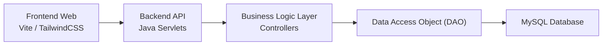

# 💊 TMT Pharmacy Chain Management

> Hệ thống quản lý chuỗi nhà thuốc được xây dựng với Java Servlet + MySQL, gồm backend API, giao diện frontend (Vite + TailwindCSS) cho các nghiệp vụ bán hàng (POS), quản lý kho thuốc và hóa đơn.

     

## ✨ Tổng quan

Dự án này là hệ thống quản lý chuỗi nhà thuốc (Pharmacy Chain Management) của Nhóm 5. Hệ thống tập trung vào các chức năng cốt lõi của một hệ thống POS (Point of Sale), quản lý danh mục thuốc (Medicine), quản lý hóa đơn (Invoice) với kiến trúc Backend dùng Java Servlet và Frontend hiện đại dùng Vite kết hợp TailwindCSS. 

Mã nguồn được chia làm 2 phần chính đặt trong `src/core_app/`:
- `backend`: Backend API xây dựng trên nền tảng Jakarta Servlet API 6.0, kết nối cơ sở dữ liệu MySQL và build bằng Maven thành file `.war`.
- `frontend`: Giao diện web SPA được xây dựng nhanh với Vite JS và style bằng Tailwind CSS, hỗ trợ phục vụ trải nghiệm người dùng tối ưu.

### 👥 Nhóm 5 (Group_5)
| **Họ và tên** | **Mã số SV (MSSV)** |
| --- | --- |
| Lê Văn Bảo | QE190130 |
| Đào Cao Duy | QE190089 |
| Huỳnh Gia Kim | QE190014 |
| Đoàn Mạnh Đạt | QE190080 |

## 🚀 Điểm nổi bật

- Chạy trên nền tảng Java 17 và Tomcat 10.1+.
- Frontend sử dụng Vite siêu tốc kết hợp TailwindCSS cho UI.
- Quản lý kho thuốc, danh mục thuốc với Medicine DAO/Servlet.
- Hệ thống POS (Point of Sale) tích hợp với Invoice DAO.
- Xử lý dữ liệu JSON nhanh gọn qua thư viện Google Gson.
- Kiến trúc Codebase rõ ràng phân chia theo chuẩn MVC / DAO pattern.
- Cung cấp sẵn các tài liệu thiết kế cơ sở dữ liệu (`DATABASE_INFO.md`) và script tiện ích (`deploy-backend.ps1`, `start-dev.bat`).

## 🧰 Tech Stack

| Nhóm | Công nghệ |
| --- | --- |
| Backend | `Java 17`, `Jakarta Servlet API 6.0` |
| Data | `MySQL 8.2+`, `JDBC (mysql-connector-j)` |
| JSON Processing | `Google Gson` |
| Frontend | `Vite`, `HTML/JS`, `Tailwind CSS`, `PostCSS` |
| Build & Tooling | `Maven`, `Lombok`, `PowerShell Scripts` |

## 🏗️ Kiến trúc ở mức cao



## 🧩 Module chính

| Module | Mục đích | Công nghệ/Pattern |
| --- | --- | --- |
| Authentication | Đăng nhập cho dược sĩ và quản lý chuỗi. | `Servlets` |
| Medicine | Quản lý danh mục thuốc, thêm mới và tra cứu. | `MedicineServlet`, `MedicineDAO` |
| POS & Invoice | Xử lý bán hàng, tính tiền, tạo và lưu trữ hóa đơn. | `InvoiceDAO` |

## 🗂️ Cấu trúc thư mục

```text
Group_5/
|-- README.md
|-- data/
|-- docs/
`-- src/
    `-- core_app/
        |-- DATABASE_INFO.md
        |-- TM POS3.md
        |-- (các tài liệu phân tích khác)
        |-- deploy-backend.ps1
        |-- backend/
        |   |-- pom.xml
        |   `-- src/main/java/
        |       |-- controller/   (Servlet classes)
        |       `-- dao/          (Data Access Objects)
        `-- frontend/
            |-- package.json
            |-- vite.config.js
            |-- tailwind.config.js
            |-- start-dev.bat
            `-- src/
```

## ⚙️ Chạy local nhanh

### 1. 📋 Yêu cầu môi trường

- Java 17
- Maven
- Tomcat 10.1+
- MySQL Server 8.x
- Node.js (dành cho Frontend Vite)

### 2. 🗄️ Cấu hình Backend & Database

1. Import schema và dữ liệu từ định dạng cơ sở dữ liệu (xác định qua tài liệu `DATABASE_INFO.md` hoặc các file SQL trong thư mục `data`).
2. Sửa thông tin kết nối DB (chuỗi JDBC, username, password) tại Backend.
3. Build backend bằng Maven:
```powershell
cd src/core_app/backend
mvn clean package
```
4. Deploy file `backend.war` vừa được tạo (trong thư mục `target`) lên server Tomcat. Có thể sử dụng script `deploy-backend.ps1`.

### 3. ▶️ Khởi động Frontend

1. Cài đặt các gói phụ thuộc:
```powershell
cd src/core_app/frontend
npm install
```
2. Chạy Vite dev server:
```powershell
npm run dev
# Hoặc chạy thông qua script sẵn:
.\start-dev.bat
```
Server Frontend mặc định sẽ chạy ở port tuỳ theo cấu hình Vite (thường là `http://localhost:5173`).

## 📡 Tài liệu hệ thống

Tham khảo thêm các luồng xử lý và thiết kế Database ở thư mục `src/core_app/`:
- `DATABASE_INFO.md`: Chi tiết cấu trúc các bảng và trường trong cơ sở dữ liệu MySQL.
- `QUERY to the Database.md`: Danh sách các câu query mẫu và phân tích dữ liệu.
- `TM POS.md` / `TM POS2.md` / `TM POS3.md`: Luồng hoạt động hệ thống POS, kiến trúc liên kết giữa Frontend và Backend.
- `Memory.md`: Ghi chú nội bộ luồng và technical details.
- `Log AI.md`: Log của các phiên làm việc và hỗ trợ codebase.

## 🎯 Khi nào nên dùng repo này

Repo này phục vụ như:
- Dự án bài tập lớn/Capstone chuẩn về thiết kế mô hình MVC Servlet cổ điển kết hợp Frontend hiện đại (Vite).
- Template để mở rộng phát triển các nghiệp vụ nhà thuốc, bán sỉ/lẻ dược phẩm đặc thù tại VN.
