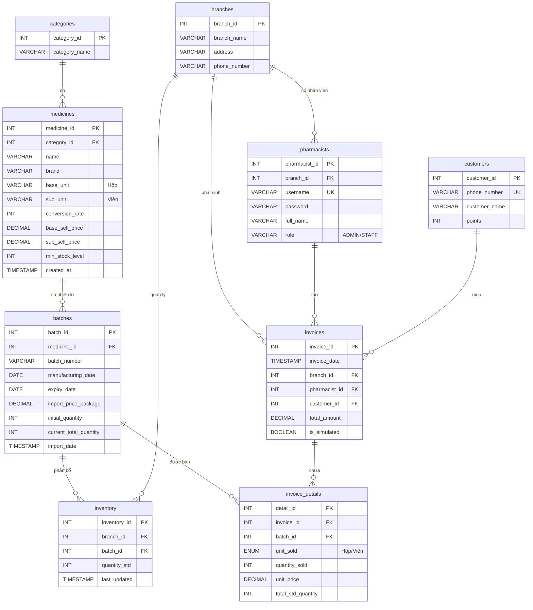

# 1️⃣ ERD - SƠ ĐỒ QUAN HỆ THỰC THỂ (CHÍNH XÁC THEO DATABASE)

## 📊 Database: pharmacy_v15

---

## 🔗 QUAN HỆ GIỮA CÁC BẢNG:

| Bảng Chính | Quan hệ | Bảng Phụ | Giải thích |
|------------|---------|----------|------------|
| **categories** | 1 → N | medicines | 1 danh mục có nhiều loại thuốc |
| **medicines** | 1 → N | batches | 1 loại thuốc có nhiều lô hàng |
| **batches** | 1 → N | inventory | 1 lô được phân bổ cho nhiều chi nhánh |
| **batches** | 1 → N | invoice_details | 1 lô được bán trong nhiều đơn |
| **branches** | 1 → N | inventory | 1 chi nhánh quản lý nhiều lô |
| **branches** | 1 → N | pharmacists | 1 chi nhánh có nhiều nhân viên |
| **branches** | 1 → N | invoices | 1 chi nhánh phát sinh nhiều hóa đơn |
| **pharmacists** | 1 → N | invoices | 1 nhân viên tạo nhiều hóa đơn |
| **customers** | 1 → N | invoices | 1 khách hàng có nhiều đơn hàng |
| **invoices** | 1 → N | invoice_details | 1 hóa đơn có nhiều dòng chi tiết |

---

## 🎤 CÂU THUYẾT TRÌNH:

> **"Đây là sơ đồ ERD của hệ thống với 9 bảng chính. Ở trung tâm là bảng Medicines (thuốc) có quan hệ 1-nhiều với Batches (lô hàng). Mỗi lô được phân bổ cho các chi nhánh qua bảng Inventory (tồn kho). Khi bán hàng, nhân viên (Pharmacists) thuộc 1 chi nhánh (Branches) tạo hóa đơn (Invoices) cho khách hàng (Customers), trong đó chi tiết hóa đơn (Invoice_Details) liên kết với các lô thuốc cụ thể."**

---

## 📋 HƯỚNG DẪN XUẤT ẢNH:

1. Copy đoạn Mermaid code ở trên
2. Vào https://mermaid.live  
3. Paste vào và xuất PNG
4. Lưu thành: `ERD-pharmacy-v15.png`
