# 3️⃣ FLOWCHART - QUY TRÌNH BÁN HÀNG TẠI QUẦY (CHÍNH XÁC THEO CODE)

## 🔄 Quy trình: POS (Point of Sale) + FIFO Inventory

```mermaid
flowchart TD
    Start([Bắt đầu bán hàng]) --> CheckLogin{Nhân viên đã đăng nhập?}
    
    CheckLogin -->|Không| RedirectLogin[Chuyển đến trang đăng nhập]
    RedirectLogin --> LoginForm[Nhập username và password]
    LoginForm --> ValidateLogin{Kiểm tra thông tin}
    ValidateLogin -->|Sai| ErrorLogin[Hiển thị lỗi đăng nhập]
    ErrorLogin --> LoginForm
    ValidateLogin -->|Đúng| SaveSession[Lưu session + thông tin nhân viên]
    SaveSession --> POSPage
    
    CheckLogin -->|Có| POSPage[Trang bán hàng POS]
    
    POSPage --> SearchMed[Tìm kiếm và chọn thuốc cần bán]
    
    SearchMed --> CheckInventory{Kiểm tra tồn kho chi nhánh}
    
    CheckInventory -->|Hết hàng| ShowAlert[Hiển thị: Thuốc hết hàng tại chi nhánh]
    ShowAlert --> SuggestImport{Có muốn nhập từ kho tổng?}
    SuggestImport -->|Có| GoInventory[Chuyển sang trang Inventory]
    GoInventory --> End1([Kết thúc quy trình bán hàng])
    SuggestImport -->|Không| SearchMed
    
    CheckInventory -->|Còn hàng| ShowStock[Hiển thị số lượng tồn kho]
    
    ShowStock --> SelectUnit[Chọn đơn vị bán: Hộp hoặc Viên]
    
    SelectUnit --> InputQty[Nhập số lượng muốn bán]
    
    InputQty --> ValidateQty{Số lượng hợp lệ?}
    
    ValidateQty -->|Vượt quá tồn kho| QtyError[Thông báo: Không đủ hàng trong kho]
    QtyError --> InputQty
    
    ValidateQty -->|Hợp lệ| CalcStdQty[Tính số lượng chuẩn theo conversion_rate]
    
    CalcStdQty --> CalcPrice[Tính giá tiền theo đơn vị]
    
    CalcPrice --> AddToCart[Thêm vào giỏ hàng]
    
    AddToCart --> ShowCart[Hiển thị giỏ hàng với tổng tiền]
    
    ShowCart --> MoreItems{Có thêm thuốc khác?}
    
    MoreItems -->|Có| SearchMed
    MoreItems -->|Không| InputCustomer[Nhập số điện thoại khách hàng - tùy chọn]
    
    InputCustomer --> CheckCustomer{Khách hàng đã tồn tại?}
    CheckCustomer -->|Có| LoadCustomer[Tải thông tin + điểm tích lũy]
    CheckCustomer -->|Không| CreateCustomer[Tạo khách hàng mới]
    CreateCustomer --> LoadCustomer
    CheckCustomer -->|Bỏ qua| GuestMode[Bán hàng không ghi nhận khách]
    LoadCustomer --> GuestMode
    
    GuestMode --> ClickCheckout[Nhấn nút Thanh toán]
    
    ClickCheckout --> StartTransaction[Bắt đầu transaction database]
    
    StartTransaction --> CreateInvoice[Tạo hóa đơn trong bảng invoices]
    
    CreateInvoice --> GetInvoiceId[Lấy invoice_id vừa tạo]
    
    GetInvoiceId --> LoopItems[Duyệt từng sản phẩm trong giỏ hàng]
    
    LoopItems --> InsertDetail[Thêm vào bảng invoice_details]
    
    InsertDetail --> FindBatchFIFO[Tìm batch có hạn sử dụng gần nhất - FIFO]
    
    FindBatchFIFO --> DeductInventory[Trừ số lượng trong bảng inventory]
    
    DeductInventory --> CheckDeduct{Trừ thành công?}
    
    CheckDeduct -->|Lỗi| Rollback[Rollback transaction]
    Rollback --> ShowError[Hiển thị lỗi giao dịch]
    ShowError --> End2([Kết thúc - Thất bại])
    
    CheckDeduct -->|Thành công| MoreItemsLoop{Còn sản phẩm trong giỏ?}
    
    MoreItemsLoop -->|Có| LoopItems
    MoreItemsLoop -->|Không| UpdatePoints{Khách hàng có tài khoản?}
    
    UpdatePoints -->|Có| AddPoints[Cộng điểm tích lũy cho khách]
    UpdatePoints -->|Không| CommitTransaction
    AddPoints --> CommitTransaction[Commit transaction]
    
    CommitTransaction --> ShowSuccess[Hiển thị: Thanh toán thành công]
    
    ShowSuccess --> PrintInvoice[In hóa đơn cho khách hàng]
    
    PrintInvoice --> ClearCart[Xóa giỏ hàng]
    
    ClearCart --> End3([Kết thúc - Thành công])
    
    %% Styling
    style Start fill:#4ade80,stroke:#22c55e,stroke-width:3px,color:#000
    style End1 fill:#4ade80,stroke:#22c55e,stroke-width:3px,color:#000
    style End2 fill:#ef4444,stroke:#dc2626,stroke-width:3px,color:#fff
    style End3 fill:#4ade80,stroke:#22c55e,stroke-width:3px,color:#000
    style ShowAlert fill:#fca5a5,stroke:#ef4444,stroke-width:2px
    style QtyError fill:#fca5a5,stroke:#ef4444,stroke-width:2px
    style ShowError fill:#fca5a5,stroke:#ef4444,stroke-width:2px
    style ShowSuccess fill:#a5f3fc,stroke:#06b6d4,stroke-width:2px
    style CommitTransaction fill:#bfdbfe,stroke:#3b82f6,stroke-width:2px
    style FindBatchFIFO fill:#fde047,stroke:#facc15,stroke-width:2px
```

---

## 🔑 ĐIỂM NỔI BẬT:

### **1. FIFO (First In First Out)**
- Khi bán, hệ thống tự động chọn lô có hạn sử dụng gần nhất
- Đảm bảo thuốc không bị hết hạn

### **2. Transaction Safety**
- Sử dụng `setAutoCommit(false)`
- Nếu 1 bước lỗi → Rollback toàn bộ
- Đảm bảo tính toàn vẹn dữ liệu

### **3. Conversion Rate**
- Bán theo Hộp hoặc Viên
- Tự động quy đổi: 1 Hộp = N Viên
- Lưu số lượng chuẩn (std_quantity) vào database

### **4. Customer Points**
- Khách hàng tích điểm khi mua
- Có thể dùng số điện thoại để tra cứu

---

## 🎤 CÂU THUYẾT TRÌNH:

> **"Quy trình bán hàng bắt đầu khi nhân viên đã đăng nhập. Họ chọn thuốc, hệ thống kiểm tra tồn kho tại chi nhánh. Nếu còn hàng, nhân viên chọn đơn vị (Hộp/Viên) và số lượng. Khi thanh toán, hệ thống bắt đầu transaction, tạo hóa đơn, duyệt từng sản phẩm trong giỏ để ghi chi tiết và trừ tồn kho theo nguyên tắc FIFO (lô gần hết hạn nhất được bán trước). Nếu mọi thứ thành công, commit transaction và in hóa đơn. Nếu có lỗi, rollback toàn bộ."**

---

## 📋 HƯỚNG DẪN XUẤT ẢNH:

1. Copy đoạn Mermaid code
2. Vào https://mermaid.live
3. Paste vào  
4. Xuất PNG: `Flowchart-Quy-Trinh-Ban-Hang.png`

---

## 📌 LƯU Ý KHI THUYẾT TRÌNH:

- ✅ Nói "Quy trình bán hàng" thay vì "POS flow"
- ✅ Nói "Giao dịch cơ sở dữ liệu" thay vì "Database transaction"  
- ✅ Nói "Hoàn tác" thay vì "Rollback"
- ✅ Nói "Xác nhận" thay vì "Commit"
