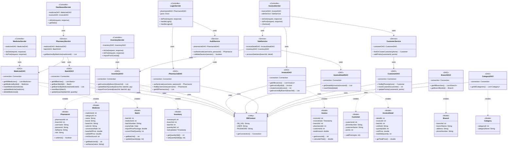

# 2️⃣ CLASS DIAGRAM - SƠ ĐỒ LỚP (CHÍNH XÁC THEO CODE BACKEND)

## 🏗️ Kiến trúc: MVC + DAO Pattern

```mermaid
classDiagram
    %% ========== CONTROLLERS (11 classes) ==========
    class LoginServlet {
        <<Controller>>
        - pharmacistDAO: PharmacistDAO
        - gson: Gson
        + doPost(request, response)
        + handleLogin()
        + handleLogout()
    }

    class MedicineServlet {
        <<Controller>>
        - medicineDAO: MedicineDAO
        + doGet(request, response)
        + doPost(request, response)
    }

    class InventoryServlet {
        <<Controller>>
        - inventoryDAO: InventoryDAO
        + doGet(request, response)
        + doPost(request, response)
        + importFromCentral()
    }

    class InvoiceServlet {
        <<Controller>>
        - invoiceDAO: InvoiceDAO
        - saleService: SaleService
        + doGet(request, response)
        + doPost(request, response)
        + checkout()
    }

    class DashboardServlet {
        <<Controller>>
        - medicineDAO: MedicineDAO
        - invoiceDAO: InvoiceDAO
        + doGet(request, response)
        + getStats()
    }

    %% ========== SERVICES (4 classes) ==========
    class AuthService {
        <<Service>>
        - pharmacistDAO: PharmacistDAO
        + authenticate(username, password): Pharmacist
        + validateSession(session): boolean
    }

    class SaleService {
        <<Service>>
        - invoiceDetailDAO: InvoiceDetailDAO
        - inventoryDAO: InventoryDAO
        + processSaleItem(branchId, detail)
    }

    class PharmacyService {
        <<Service>>
        - medicineDAO: MedicineDAO
        - batchDAO: BatchDAO
        + getBatchesByMedicine(medicineId): List
    }

    class CustomerService {
        <<Service>>
        - customerDAO: CustomerDAO
        + findOrCreateCustomer(phone): Customer
        + addPoints(customerId, points)
    }

    %% ========== DAOs (9 classes) ==========
    class MedicineDAO {
        <<DAO>>
        - connection: Connection
        + getAllMedicines(): List~Medicine~
        + getMedicineById(id): Medicine
        + insertMedicine(medicine)
        + updateMedicine(medicine)
        + deleteMedicine(id)
    }

    class BatchDAO {
        <<DAO>>
        - connection: Connection
        + getAllBatches(): List~Batch~
        + getBatchById(id): Batch
        + getBatchesByMedicine(medicineId): List
        + insertBatch(batch)
        + updateQuantity(batchId, quantity)
    }

    class InventoryDAO {
        <<DAO>>
        - connection: Connection
        + getInventoryByBranch(branchId): List
        + updateBatchQuantity(branchId, batchId, qty)
        + importFromCentral(branchId, batchId, qty)
    }

    class InvoiceDAO {
        <<DAO>>
        - connection: Connection
        + getAllInvoices(): List~Invoice~
        + getInvoiceById(id): Invoice
        + createInvoice(invoice): int
        + getInvoicesByBranch(branchId): List
    }

    class InvoiceDetailDAO {
        <<DAO>>
        - connection: Connection
        + getDetailsByInvoice(invoiceId): List
        + insertDetail(detail)
    }

    class PharmacistDAO {
        <<DAO>>
        - connection: Connection
        + authenticate(username, password): Pharmacist
        + findByUsername(username): Pharmacist
        + getAllPharmacists(): List
    }

    class CustomerDAO {
        <<DAO>>
        - connection: Connection
        + findByPhone(phone): Customer
        + insertCustomer(customer): int
        + updatePoints(customerId, points)
    }

    class BranchDAO {
        <<DAO>>
        - connection: Connection
        + getAllBranches(): List~Branch~
        + getBranchById(id): Branch
    }

    class CategoryDAO {
        <<DAO>>
        - connection: Connection
        + getAllCategories(): List~Category~
    }

    %% ========== MODELS (9 classes) ==========
    class Medicine {
        <<Model>>
        - medicineId: int
        - categoryId: int
        - name: String
        - brand: String
        - baseUnit: String
        - subUnit: String
        - conversionRate: int
        - baseSellPrice: double
        - subSellPrice: double
        - minStockLevel: int
        + getMedicineId(): int
        + setName(name: String)
    }

    class Batch {
        <<Model>>
        - batchId: int
        - medicineId: int
        - batchNumber: String
        - expiryDate: Date
        - importPricePackage: double
        - currentTotalQuantity: int
        + getBatchId(): int
        + updateQuantity(qty: int)
    }

    class Inventory {
        <<Model>>
        - inventoryId: int
        - branchId: int
        - batchId: int
        - quantityStd: int
        - lastUpdated: Timestamp
        + getQuantityStd(): int
        + setQuantityStd(qty: int)
    }

    class Invoice {
        <<Model>>
        - invoiceId: int
        - invoiceDate: Timestamp
        - branchId: int
        - pharmacistId: int
        - customerId: int
        - totalAmount: double
        + getInvoiceId(): int
        + calculateTotal(): double
    }

    class InvoiceDetail {
        <<Model>>
        - detailId: int
        - invoiceId: int
        - batchId: int
        - unitSold: String
        - quantitySold: int
        - unitPrice: double
        - totalStdQuantity: int
        + getTotalPrice(): double
    }

    class Pharmacist {
        <<Model>>
        - pharmacistId: int
        - branchId: int
        - username: String
        - password: String
        - fullName: String
        - role: String
        + isAdmin(): boolean
    }

    class Customer {
        <<Model>>
        - customerId: int
        - phoneNumber: String
        - customerName: String
        - points: int
        + addPoints(pts: int)
    }

    class Branch {
        <<Model>>
        - branchId: int
        - branchName: String
        - address: String
        - phoneNumber: String
    }

    class Category {
        <<Model>>
        - categoryId: int
        - categoryName: String
    }

    %% ========== UTILITY ==========
    class DBContext {
        <<Utility>>
        - DB_URL: String
        - USER: String
        - PASSWORD: String
        + getConnection(): Connection
    }

    %% ========== RELATIONSHIPS ==========
    %% Controllers use Services
    LoginServlet --> AuthService : uses
    InvoiceServlet --> SaleService : uses
    InvoiceServlet --> CustomerService : uses
    DashboardServlet --> PharmacyService : uses

    %% Controllers use DAOs
    MedicineServlet --> MedicineDAO : uses
    InventoryServlet --> InventoryDAO : uses
    InvoiceServlet --> InvoiceDAO : uses
    LoginServlet --> PharmacistDAO : uses

    %% Services use DAOs
    AuthService --> PharmacistDAO : uses
    SaleService --> InvoiceDetailDAO : uses
    SaleService --> InventoryDAO : uses
    PharmacyService --> MedicineDAO : uses
    PharmacyService --> BatchDAO : uses
    CustomerService --> CustomerDAO : uses

    %% DAOs use Models
    MedicineDAO ..> Medicine : creates
    BatchDAO ..> Batch : creates
    InventoryDAO ..> Inventory : creates
    InvoiceDAO ..> Invoice : creates
    InvoiceDetailDAO ..> InvoiceDetail : creates
    PharmacistDAO ..> Pharmacist : creates
    CustomerDAO ..> Customer : creates
    BranchDAO ..> Branch : creates
    CategoryDAO ..> Category : creates

    %% All DAOs use DBContext
    MedicineDAO --> DBContext : uses
    BatchDAO --> DBContext : uses
    InventoryDAO --> DBContext : uses
    InvoiceDAO --> DBContext : uses
    InvoiceDetailDAO --> DBContext : uses
    PharmacistDAO --> DBContext : uses
    CustomerDAO --> DBContext : uses
    BranchDAO --> DBContext : uses
    CategoryDAO --> DBContext : uses
```

---

## 🎯 GIẢI THÍCH 4 TẦNG:

### **1. Controller (11 Servlets)**
- Nh·∫≠n HTTP request t·ª´ Frontend
- Gọi Service/DAO xử lý
- Tr·∫£ JSON response

### **2. Service (4 classes)**
- Chứa logic nghiệp vụ phức tạp
- Kết hợp nhiều DAO
- VD: SaleService xử lý cả InvoiceDetail + Inventory

### **3. DAO (9 classes)**
- Truy xuất database (CRUD)
- Mỗi DAO tương ứng 1 bảng
- Sử dụng DBContext để kết nối

### **4. Model (9 classes)**
- Đại diện cho các Entity trong database
- Chứa thuộc tính + getter/setter
- POJO (Plain Old Java Object)

---

## 🎤 CÂU THUYẾT TRÌNH:

> **"Hệ thống backend áp dụng mô hình MVC với DAO Pattern. Có 11 Controller (Servlet) nhận request, 4 Service xử lý logic nghiệp vụ, 9 DAO tương tác database, và 9 Model đại diện cho các Entity. Luồng xử lý: Controller → Service → DAO → Model → Database. Class DBContext quản lý kết nối MySQL chung."**

---

## 📋 HƯỚNG DẪN XUẤT ẢNH:

1. Copy đoạn Mermaid code
2. Vào https://mermaid.live
3. Paste và chỉnh layout nếu cần
4. Xuất PNG: `Class-Diagram-Backend.png`
