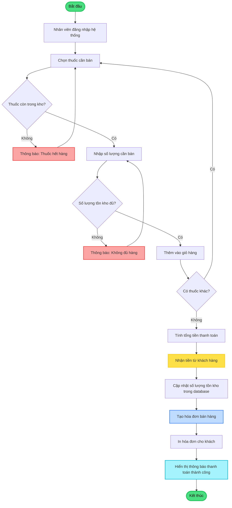

# FLOWCHART 2: QUY TRÌNH BÁN HÀNG TẠI QUẦY (100% TIẾNG VIỆT)

## Hướng dẫn xuất ra PNG:

1. Copy đoạn code Mermaid ở trên
2. Vào https://mermaid.live
3. Paste vào
4. Click "Actions" → "PNG" → Download
5. Lưu đè lên file: `flowchart-ban-hang.png`
