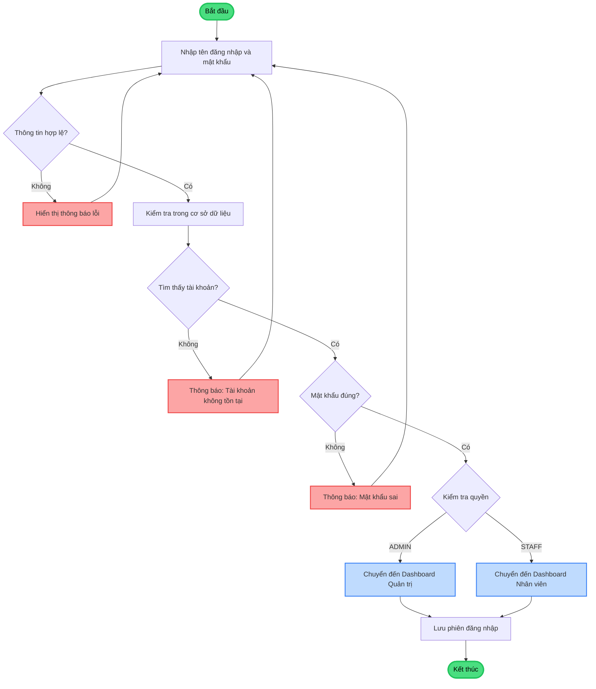

# FLOWCHART 1: QUY TRÌNH ĐĂNG NHẬP (100% TIẾNG VIỆT)

## Hướng dẫn xuất ra PNG:

1. Copy đoạn code Mermaid ở trên
2. Vào https://mermaid.live
3. Paste vào
4. Click "Actions" → "PNG" → Download
5. Lưu đè lên file cũ: `flowchart-moisua.png`
